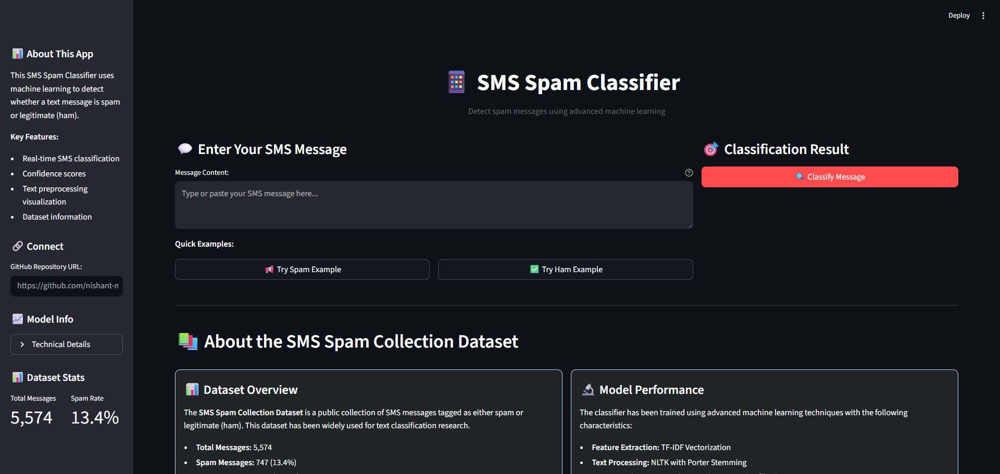
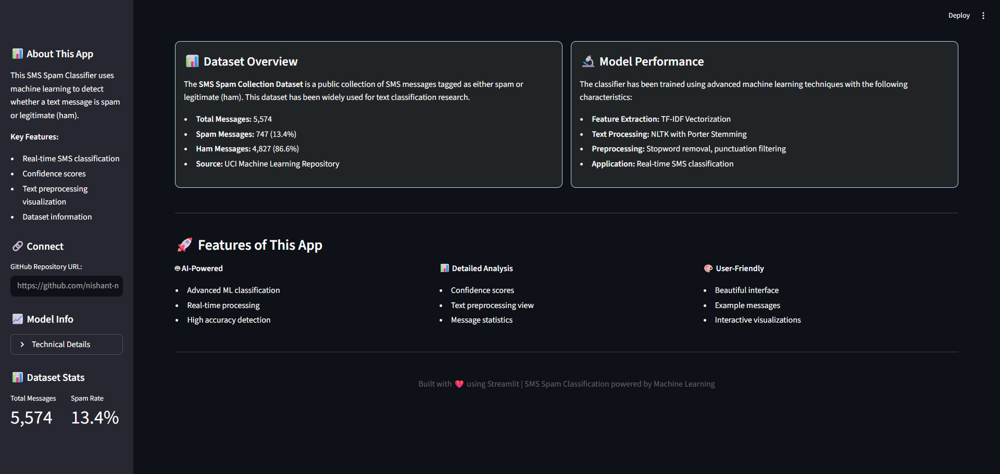
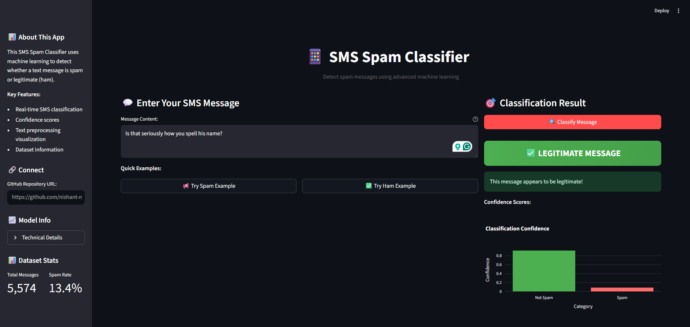
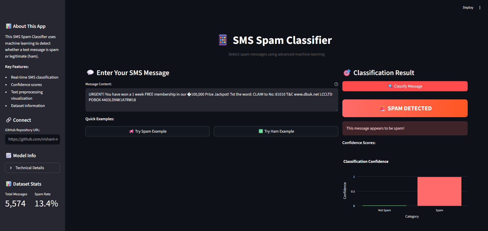
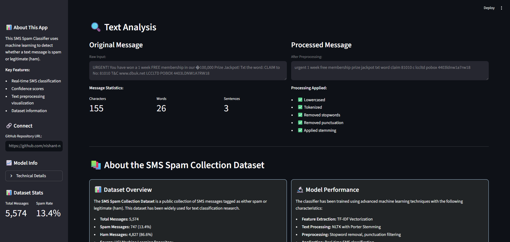

# SMS Spam Classifier

This project is a machine learning application that classifies SMS messages as **Spam** or **Ham (Not Spam)** using natural language processing (NLP) techniques.
It includes both a Jupyter Notebook for model training and a **Streamlit web app** for easy interaction with the model.

---

## 📊 Dataset

We use the **SMS Spam Collection Dataset**, which contains thousands of labeled SMS messages:

- `ham` → Legitimate message
- `spam` → Unwanted/spam message

---

## 🧠 Project Workflow

### 1. Data Loading & Exploration

- Loaded dataset (`spam.csv`) into a Pandas DataFrame.
- Performed data cleaning: removing unnecessary columns and renaming headers.
- Checked for missing values and data distribution.

### 2. Data Preprocessing

- Text preprocessing included:
  - Lowercasing
  - Removing punctuation/special characters
  - Tokenization
  - Stopword removal
  - Stemming using **PorterStemmer**
- Transformed messages into a new column `transformed_text`.

### 3. Feature Extraction

- Used **Bag of Words (BoW)** and **TF-IDF Vectorization** to convert text into numerical features.
- Experimented with different feature dimensions for efficiency and accuracy.

### 4. Model Training

- Split dataset into **train** and **test** sets.
- Trained and compared multiple models:
  - Naive Bayes
  - Logistic Regression
  - Support Vector Machine (SVM)
  - Random Forest
- Evaluated models using **accuracy, precision, recall, and F1-score**.

### 5. Final Model

- Selected the best performing model (Multinomial Naive Bayes).
- Saved the trained model and vectorizer using `pickle` for later use.

---

## 🌐 Streamlit Web App

A simple Streamlit app was developed for user interaction:

- Users can input an SMS message.
- The app predicts whether the message is **Spam** or **Ham**.
- The app uses the pickled model and vectorizer for inference.

---

## ⚙️ Installation & Setup

### 1. Clone the Repository

```bash
git clone https://github.com/nishant-nez/SMS-Spam-Classifier.git
cd SMS-Spam-Classifier
```

### 2. Create Virtual Environment

```bash
python -m venv .venv
.\.venv\Scripts\activate    # On Windows
source .venv/bin/activate   # On Mac/Linux
```

### 3. Install Dependencies

```bash
pip install -r requirements.txt
```

### 4. Run the Streamlit App

```bash
streamlit run app.py
```

---

## 📸 Screenshots







---

## 👨‍💻 Author

**Nishant Khadka**
